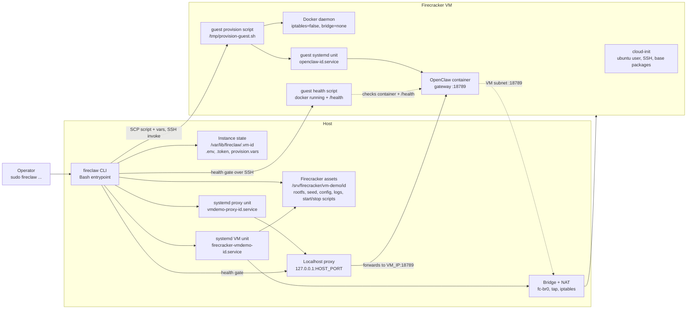

# fireclaw

Run [OpenClaw](https://github.com/openclaw/openclaw) instances inside Firecracker microVMs with per-instance isolation (filesystem, process tree, and virtual network).

`fireclaw` is intentionally small: a Bash CLI that drives Firecracker + systemd without adding Kubernetes or an always-on control-plane daemon.

## Table of contents

- [What you get](#what-you-get)
- [How it works](#how-it-works)
- [Prerequisites](#prerequisites)
- [Install](#install)
- [Quick start](#quick-start)
- [Command reference](#command-reference)
- [Setup flags](#setup-flags)
- [Networking and allocation](#networking-and-allocation)
- [State layout](#state-layout)
- [Environment variable overrides](#environment-variable-overrides)
- [Operations playbook](#operations-playbook)
- [Troubleshooting](#troubleshooting)
- [Development](#development)
- [Security model](#security-model)

## What you get

- VM-level isolation for each OpenClaw instance.
- Fast lifecycle control with host systemd units.
- Localhost-bound host proxy for gateway access.
- One-shot provisioning (`setup`) plus repeatable guest reprovisioning (`provision`).
- File-based state that is easy to inspect and recover.

## How it works



The stable runtime names still include `vmdemo` (`/srv/firecracker/vm-demo`, `firecracker-vmdemo-*`, and `vmdemo-proxy-*`) so existing instances keep working. The package, CLI, and agent skill are named `fireclaw`.

Lifecycle behavior:

- `setup` validates inputs, allocates a host port and VM IP, writes root-only instance state, builds Firecracker assets, creates host systemd units, boots the VM, waits for SSH, then SCPs `provision-guest.sh` and `provision.vars` into `/tmp` for guest setup. It returns success only after both the localhost proxy and guest health checks pass.
- Failed `setup` rolls back only the instance being created: temporary units are stopped/removed, the tap is deleted when present, systemd is reloaded, and partial state/assets are removed.
- `provision <id>` reuses an existing VM and saved `provision.vars`. It can update `TELEGRAM_USERS`, reruns guest provisioning, rewrites OpenClaw config, restarts `openclaw-<id>.service`, re-enables the proxy, and requires the same guest + proxy health gate. It does not allocate a new IP, port, or disk.
- `start <id>` starts the existing VM unit, waits for SSH, starts the existing guest service and proxy, then health-gates. It does not reprovision.
- `stop <id>` stops proxy first, then guest service when SSH is reachable, then the VM. `destroy <id>` removes host units plus state/assets.

Builder caveats:

- The host proxy is localhost-only (`127.0.0.1:<HOST_PORT>`), but the guest gateway binds inside the VM on `0.0.0.0:18789`; keep bridge/subnet reachability private.
- Docker is installed/configured by guest provisioning, not cloud-init. The container runs with `--network host`, and Docker bridge/iptables are disabled for Firecracker.
- `setup`, `provision`, and `start` are strict health-gated commands. `list` and `status` are looser inspection commands and may show health as up when either host or guest health responds.
- Automatic VM IP allocation currently assumes a `/24` subnet, and automatic host ports start above `BASE_PORT` (default first port: `18891`).

## Prerequisites

Host:

- Linux with KVM (`/dev/kvm` available).
- Root/sudo access for lifecycle and networking operations.
- `firecracker` available on `PATH`.
- `cloud-localds`, `qemu-img`, `iptables`, `ip`, `socat`, `jq`, `curl`, `openssl`, `ssh`, `scp`, `systemctl`, `install`.

Base images:

- Kernel image (`vmlinux`).
- ext4 rootfs with cloud-init support.
- Optional initrd.

Default base image directory is `/srv/firecracker/base/images`.

## Install

```bash
npm install -g fireclaw
```

## Quick start

```bash
sudo fireclaw setup \
  --instance my-bot \
  --telegram-token "<telegram-bot-token>" \
  --telegram-users "<comma-separated-allowed-user-ids>" \
  --model "openai/gpt-5.4" \
  --openai-api-key "<key>"
```

Telegram DMs use an allowlist and groups are disabled. Provide at least one user ID with `--telegram-users`; guest provisioning fails if the allowlist is empty.

Check status and health:

```bash
sudo fireclaw status my-bot
curl -fsS http://127.0.0.1:<HOST_PORT>/health
```

## Command reference

```bash
fireclaw setup <flags...>
fireclaw provision <id> [--telegram-users <csv>]
fireclaw list
fireclaw status [id]
fireclaw start <id>
fireclaw stop <id>
fireclaw restart <id>
fireclaw logs <id> [guest|host]
fireclaw shell <id> [command...]
fireclaw token <id>
fireclaw destroy <id> [--force]
```

Common lifecycle examples:

```bash
sudo fireclaw list
sudo fireclaw status my-bot
sudo fireclaw logs my-bot guest
sudo fireclaw logs my-bot host
sudo fireclaw shell my-bot
sudo fireclaw shell my-bot "docker ps"
sudo fireclaw token my-bot
sudo fireclaw restart my-bot
sudo fireclaw destroy my-bot --force
```

Reprovision an existing VM guest:

```bash
sudo fireclaw provision my-bot
```

For older instances created without an allowlist, set it during reprovision:

```bash
sudo fireclaw provision my-bot --telegram-users "<comma-separated-allowed-user-ids>"
```

## Setup flags

| Flag | Required | Default | Description |
|------|----------|---------|-------------|
| `--instance <id>` | yes | - | Instance ID (`[a-z0-9_-]+`) |
| `--telegram-token <token>` | yes | - | Telegram bot token |
| `--telegram-users <csv>` | yes | - | Allowed Telegram user IDs; provisioning fails if empty |
| `--model <id>` | no | `openai/gpt-5.4` | OpenClaw model |
| `--skills <csv>` | no | `github,tmux,coding-agent,session-logs,skill-creator` | Skill set |
| `--openclaw-image <image>` | no | `ghcr.io/openclaw/openclaw:latest` | OpenClaw container image |
| `--host-port <n>` | no | first free port above `BASE_PORT` | Host localhost proxy port |
| `--vm-vcpu <n>` | no | `4` | VM vCPU count |
| `--vm-mem-mib <n>` | no | `8192` | VM memory in MiB |
| `--disk-size <size>` | no | `40G` | Rootfs resize target |
| `--api-sock <path>` | no | `<fc-instance-dir>/firecracker.socket` | Firecracker API socket path |
| `--base-kernel <path>` | no | `<BASE_IMAGES_DIR>/vmlinux` | Kernel path |
| `--base-rootfs <path>` | no | `<BASE_IMAGES_DIR>/rootfs.ext4` | Rootfs path |
| `--base-initrd <path>` | no | `<BASE_IMAGES_DIR>/initrd.img` | Optional initrd path |
| `--anthropic-api-key <key>` | no | empty | Anthropic key |
| `--openai-api-key <key>` | no | empty | OpenAI key |
| `--minimax-api-key <key>` | no | empty | MiniMax key |
| `--skip-browser-install` | no | `false` | Skip Playwright Chromium installation; otherwise provisioning uses the image's Playwright package when present, with a pinned fallback |

## Networking and allocation

Defaults:

- Bridge: `fc-br0`
- Bridge address: `172.16.0.1/24`
- VM subnet: `172.16.0.0/24`
- OpenClaw gateway in guest: `:18789`
- First auto host port (default): `18891` (`BASE_PORT + 1`)

Allocation behavior:

- Host port auto-allocation chooses the first free port above `BASE_PORT`.
- Auto-allocation skips ports already assigned to existing instances.
- Auto-allocation also skips currently-listening host ports (via `ss`/`lsof` when available).
- VM IP allocation is derived from `SUBNET_CIDR` and reserves the bridge gateway IP from `BRIDGE_ADDR`.
- Current automatic IP allocator requires `/24` subnets.

Access model:

- Guest service listens inside VM on `0.0.0.0:18789` and is reachable at `<VM_IP>:18789` wherever the Firecracker bridge/subnet permits.
- Host proxy binds `127.0.0.1:<HOST_PORT>` and forwards to `<VM_IP>:18789`.
- Default host access is localhost-bound through the proxy, but the VM gateway is not itself localhost-only. Keep the VM subnet and bridge routing/firewalling private.

## State layout

Per-instance control state:

- `/var/lib/fireclaw/.vm-<id>/.env`
- `/var/lib/fireclaw/.vm-<id>/.token`
- `/var/lib/fireclaw/.vm-<id>/provision.vars`

These files contain tokens/API keys and are written with `0600` permissions under an instance directory with `0700` permissions.

Firecracker runtime assets:

- `/srv/firecracker/vm-demo/<id>/images/`
- `/srv/firecracker/vm-demo/<id>/config/`
- `/srv/firecracker/vm-demo/<id>/logs/`
- `/srv/firecracker/vm-demo/<id>/start-vm.sh`
- `/srv/firecracker/vm-demo/<id>/stop-vm.sh`

Host unit files:

- `/etc/systemd/system/firecracker-vmdemo-<id>.service`
- `/etc/systemd/system/vmdemo-proxy-<id>.service`

## Environment variable overrides

| Variable | Default | Notes |
|----------|---------|-------|
| `STATE_ROOT` | `/var/lib/fireclaw` | Per-instance state root |
| `FC_ROOT` | `/srv/firecracker/vm-demo` | Firecracker runtime root |
| `BASE_PORT` | `18890` | Auto host-port base |
| `BRIDGE_NAME` | `fc-br0` | Linux bridge name |
| `BRIDGE_ADDR` | `172.16.0.1/24` | Bridge/gateway address |
| `SUBNET_CIDR` | `172.16.0.0/24` | VM subnet (`/24` for auto IP alloc) |
| `SSH_KEY_PATH` | `/home/ubuntu/.ssh/vmdemo_vm` | SSH key for VM access |
| `BASE_IMAGES_DIR` | `/srv/firecracker/base/images` | Kernel/rootfs/initrd base dir |
| `DISK_SIZE` | `40G` | Default setup disk target |
| `API_SOCK` | `<fc-instance-dir>/firecracker.socket` | Default per-instance API socket |
| `OPENCLAW_IMAGE_DEFAULT` | `ghcr.io/openclaw/openclaw:latest` | Default OpenClaw image |

## Operations playbook

Inspect fleet:

```bash
sudo fireclaw list
sudo fireclaw status
```

Tail logs:

```bash
sudo fireclaw logs my-bot guest
sudo fireclaw logs my-bot host
```

Run guest command:

```bash
sudo fireclaw shell my-bot "sudo systemctl status openclaw-my-bot.service"
```

Rotate by reprovisioning:

```bash
sudo fireclaw stop my-bot
sudo fireclaw start my-bot
sudo fireclaw provision my-bot
```

Provisioning rewrites guest config and restarts `openclaw-my-bot.service`; use it after changing saved env/config/image values.

Health gating:

- `setup`, `provision`, and `start` require both the guest health script and the localhost proxy `/health` endpoint to pass before returning success.
- A failed `setup` rolls back only the instance it was creating. It does not touch existing instances.
- Guest-side `/tmp/provision.vars` and `/tmp/provision-guest.sh` are removed after provisioning exits.

## Troubleshooting

VM does not start:

- Check host unit logs: `sudo journalctl -u firecracker-vmdemo-<id>.service -xe`
- Validate KVM and Firecracker binary path.
- Ensure API socket path is unique and writable.
- If setup exits non-zero, verify rollback with `sudo fireclaw list` and `sudo systemctl list-units --all 'firecracker-vmdemo-<id>*' 'vmdemo-proxy-<id>*'`.

SSH never becomes reachable:

- Check VM state: `sudo fireclaw status <id>`
- Inspect cloud-init in guest via serial/log output.
- Confirm SSH key path and permissions.

Proxy health fails:

- Host side: `curl -v http://127.0.0.1:<port>/health`
- Guest side: `sudo fireclaw shell <id> "curl -fsS http://127.0.0.1:18789/health"`
- Confirm `openclaw-<id>.service` is active in guest.

Disk pressure during provisioning:

- Increase `--disk-size`.
- Re-run provisioning with `sudo fireclaw provision <id>`.

## Development

From repo root:

```bash
npm test
npm run lint:shell
npm run test:unit
npm run pack:check
```

What they do:

- `npm run lint:shell`: syntax-checks all shipped shell scripts and test scripts.
- `npm run test:unit`: runs unit tests for reusable shell helpers (`bin/vm-common.sh`).
- `npm run pack:check`: validates npm package content (`npm pack --dry-run`).

Contribution expectations:

- Keep `bin/fireclaw`, `bin/vm-setup`, and `bin/vm-ctl` usage/help text in sync with behavior.
- Update docs for all user-visible flag/default/flow changes.
- Run `npm test` before handoff.

## Security model

- Strong isolation boundary is the VM, not a container namespace.
- No host Docker socket mount into guest containers.
- The host proxy is localhost-only by default, reducing remote host attack surface. The guest gateway also listens on the VM network, so bridge/subnet reachability is part of the security boundary.
- Secrets are stored per instance under `STATE_ROOT`; instance state and VM asset directories are created root-only.
- Provisioning copies secrets into the guest only long enough to run the guest script, then removes the temporary files from `/tmp`.
