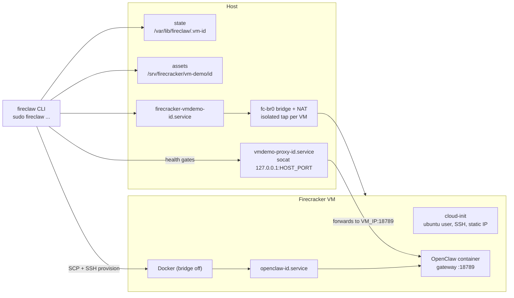

# fireclaw

Run [OpenClaw](https://github.com/openclaw/openclaw) agents inside Firecracker microVMs — one VM per instance, each with its own kernel, filesystem, Docker daemon, and network. A small Bash CLI drives Firecracker + systemd directly: no Kubernetes, no always-on daemon, no hidden state.

## How it works

`fireclaw setup` builds four things on the host, then provisions the guest over SSH:

1. **Instance state** — `/var/lib/fireclaw/.vm-<id>/` holds `.env` (allocation + config), `.token` (gateway auth token), `provision.vars` (guest provisioning input, including secrets), and `known_hosts` (the guest SSH host key, pinned after the first successful login). The directory is root-only (`0700`); the secret files are mode `0600`.
2. **VM assets** — `/srv/firecracker/vm-demo/<id>/`: a copy of the base rootfs resized to `--disk-size`, kernel (+ optional initrd), a cloud-init seed image (ubuntu user, SSH key, static IP by MAC match), the Firecracker JSON config, and generated `start-vm.sh` / `stop-vm.sh`.
3. **Two systemd units** — `firecracker-vmdemo-<id>.service` runs the VM: `Restart=always` (an in-guest reboot or VMM crash comes back on its own) and an `ExecStop` that asks the guest to shut down cleanly through the Firecracker API socket before the VMM exits. `vmdemo-proxy-<id>.service` runs socat as an unprivileged dynamic user, forwarding `127.0.0.1:<HOST_PORT>` → `<VM_IP>:18789`, and starts/stops with the VM unit.
4. **Network** — one tap per VM on the `fc-br0` bridge (`172.16.0.1/24`). Each tap is an *isolated* bridge port, so VMs cannot exchange IP or ARP traffic with each other — only with the host and, via a MASQUERADE rule, the internet. Host port and VM IP are allocated under a lock, so concurrent setups cannot collide.

Guest provisioning (`scripts/provision-guest.sh`, SCP'd in and run once over SSH) installs Docker with bridge/iptables disabled, pulls the OpenClaw image, writes the gateway/model/skills config (Telegram is enabled only when a token was provided, otherwise explicitly disabled), installs a health script, and creates `openclaw-<id>.service`, which runs the container with `--network host` serving the gateway on `:18789`. The copied secrets are removed from guest `/tmp` when the script exits.



Lifecycle semantics:

- `setup`, `provision`, and `start` return success only after **both** health gates pass: the guest health script (container running + `/health` inside the VM) and the localhost proxy `/health`. `start` never reprovisions. `list`/`status` are looser inspection views (health may read up when either the proxy or the guest check responds).
- A `setup` failure *before* guest provisioning completes rolls back only that instance (units, tap, API socket, state, assets). After guest provisioning succeeds, failures keep the instance — inspect with `status`, retry with `provision`.
- `stop` shuts down proxy → guest service → VM (clean guest shutdown via the API socket) and disables the units, so a stopped instance stays stopped across host reboots until `start`.
- `provision <id> [flags]` updates the saved config and reruns guest provisioning on the existing VM — no new IP, port, or disk. Overrides are validated first; a rejected run changes nothing.
- `destroy` removes units, tap, API socket, state, and assets; `--force` also cleans up instances with unreadable state (units and directories only — a leftover tap or socket then needs manual removal).

Naming note: runtime paths keep the historical `vmdemo` names (`/srv/firecracker/vm-demo`, `firecracker-vmdemo-*`, `vmdemo-proxy-*`) so existing instances keep working.

## Install

Host needs Linux with KVM (`/dev/kvm`), root access, `firecracker` on `PATH`, the usual tools (`systemctl`, `cloud-localds`, `qemu-img`, `iptables`, `ip`, `bridge`, `socat`, `jq`, `curl`, `openssl`, `ssh`, `scp`, `install`, `flock`), and base images (kernel + cloud-init-capable ext4 rootfs, default dir `/srv/firecracker/base/images`). `fireclaw doctor` checks all of this.

```bash
npm install -g fireclaw
```

If `sudo fireclaw` reports `command not found` (nvm/user-prefix installs aren't on root's `secure_path`):

```bash
sudo ln -s "$(command -v fireclaw)" /usr/local/bin/fireclaw
```

## Quick start

```bash
sudo fireclaw doctor

# Local-only gateway (Telegram disabled):
sudo fireclaw setup --instance my-bot --model "openai/gpt-5.5" --openai-api-key "<key>"

# Telegram bot (DM allowlist, groups disabled):
sudo fireclaw setup --instance my-bot \
  --telegram-token "<bot-token>" --telegram-users "<comma-separated-user-ids>" \
  --model "openai/gpt-5.5" --openai-api-key "<key>"
```

Setup fails fast if the model's provider key is missing (`openai/*` → OpenAI key, `anthropic/*` → Anthropic, `minimax/*` → MiniMax). Keys can come from the environment instead of flags, keeping them out of `ps` output:

```bash
sudo OPENAI_API_KEY="<key>" fireclaw setup --instance my-bot
```

Setup prints the instance's IP, proxy port, and health on success. Verify any time with:

```bash
sudo fireclaw status my-bot
curl -fsS http://127.0.0.1:<HOST_PORT>/health
```

## Commands

```bash
sudo fireclaw doctor                     # preflight: commands, /dev/kvm, base images, bridge, capacity
sudo fireclaw setup <flags...>           # create + provision a new instance (flags below)
sudo fireclaw provision <id> [flags...]  # update saved config + rerun guest provisioning
sudo fireclaw list                       # fleet table with health
sudo fireclaw status [id]                # detail for one instance (or the fleet)
sudo fireclaw start|stop|restart <id>    # lifecycle; stop persists across host reboots
sudo fireclaw logs <id> [guest|host]     # tail the guest service or host units
sudo fireclaw shell <id> ["command"]     # SSH into the VM, or run one command
sudo fireclaw token <id>                 # print the gateway auth token
sudo fireclaw destroy <id> [--force]     # full teardown
```

`provision` accepts `--telegram-token`, `--no-telegram`, `--telegram-users`, `--model`, `--skills`, `--openclaw-image`, the three API-key flags, `--skip-browser-install`, and `--browser-install` — e.g. rotate a key with `provision my-bot --openai-api-key "<new>"`, or enable Telegram on a local-only instance later.

## Setup flags

| Flag | Default | Description |
|------|---------|-------------|
| `--instance <id>` | required | Instance ID (`[a-z0-9_-]+`) |
| `--telegram-token <token>` | none | Omit for a local-only gateway with Telegram disabled |
| `--telegram-users <csv>` | none | Allowed Telegram user IDs; required with `--telegram-token` |
| `--model <id>` | `openai/gpt-5.5` | OpenClaw model; its provider API key must be set |
| `--skills <csv>` | `github,tmux,coding-agent,session-logs,skill-creator` | Skill set |
| `--openclaw-image <image>` | `ghcr.io/openclaw/openclaw:latest` | Container image |
| `--host-port <n>` | first free port above `BASE_PORT` | Localhost proxy port (>= 1024) |
| `--vm-vcpu <n>` / `--vm-mem-mib <n>` | `4` / `8192` | VM sizing |
| `--disk-size <size>` | `40G` | Rootfs resize target |
| `--api-sock <path>` | `<fc-instance-dir>/firecracker.socket` | Firecracker API socket |
| `--base-kernel/-rootfs/-initrd <path>` | `<BASE_IMAGES_DIR>/...` | Base image paths |
| `--anthropic/openai/minimax-api-key <key>` | env var or empty | Provider keys |
| `--skip-browser-install` | off | Skip Playwright Chromium in the guest |

## Defaults and state

Networking: bridge `fc-br0` at `172.16.0.1/24`, VM subnet `172.16.0.0/24` (auto-allocation requires `/24`), guest gateway `:18789`, first auto host port `18891` (`BASE_PORT`+1). The proxy is the intended access path; the guest gateway itself binds `0.0.0.0:18789` inside the VM, so keep bridge/subnet reachability private.

Overridable via environment: `STATE_ROOT` (`/var/lib/fireclaw`), `FC_ROOT` (`/srv/firecracker/vm-demo`), `BASE_PORT` (`18890`), `BRIDGE_NAME`, `BRIDGE_ADDR`, `SUBNET_CIDR`, `SSH_KEY_PATH` (`/home/ubuntu/.ssh/vmdemo_vm`), `BASE_IMAGES_DIR`, `DISK_SIZE`, `API_SOCK`, `OPENCLAW_IMAGE_DEFAULT`.

Per instance on disk: state in `STATE_ROOT/.vm-<id>/` (`.env`, `.token`, `provision.vars`, `known_hosts`), runtime in `FC_ROOT/<id>/` (`images/`, `config/`, `logs/`, `start-vm.sh`, `stop-vm.sh`), units in `/etc/systemd/system/firecracker-vmdemo-<id>.service` and `vmdemo-proxy-<id>.service`.

## Security model

- The isolation boundary is the VM, not a container namespace; no host Docker socket is mounted anywhere.
- VMs cannot reach each other (isolated bridge ports block IP and ARP between guests, plus an intra-bridge iptables `FORWARD` drop as defense-in-depth where `br_netfilter` is active); each sees only the host gateway and NATed egress.
- The host proxy is localhost-only and runs unprivileged; guest SSH host keys are pinned per instance and mismatches are reported.
- Secrets live root-only under `STATE_ROOT` (mode `0600`). The provisioning copies are removed from guest `/tmp` afterwards; the runtime secrets the service needs persist inside the guest in a `0600` env file and the OpenClaw config. The gateway token is never echoed — use `fireclaw token <id>`. Prefer env vars over flags for API keys.

## Troubleshooting

- VM won't start: `sudo journalctl -u firecracker-vmdemo-<id>.service -xe`; check `/dev/kvm` and `sudo fireclaw doctor`.
- SSH unreachable: `sudo fireclaw status <id>`; a host-key mismatch is reported explicitly — remove `STATE_ROOT/.vm-<id>/known_hosts` if the change is expected. If SSH never comes up, read the boot/console output in `/srv/firecracker/vm-demo/<id>/logs/`.
- Proxy health down: `curl -v http://127.0.0.1:<port>/health`, then `sudo fireclaw shell <id> "curl -fsS http://127.0.0.1:18789/health"`.
- Disk pressure in the guest: recreate with a larger `--disk-size`.

## Development

`npm test` runs shell syntax checks plus unit tests for `bin/vm-common.sh`; `npm run pack:check` validates package contents. Contributor conventions live in [AGENTS.md](AGENTS.md).
